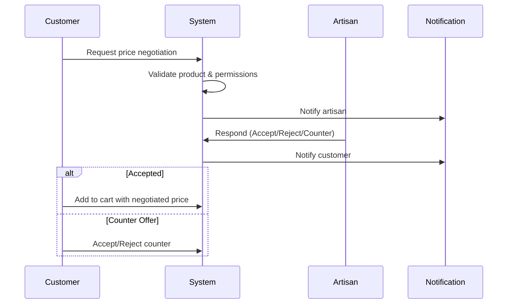
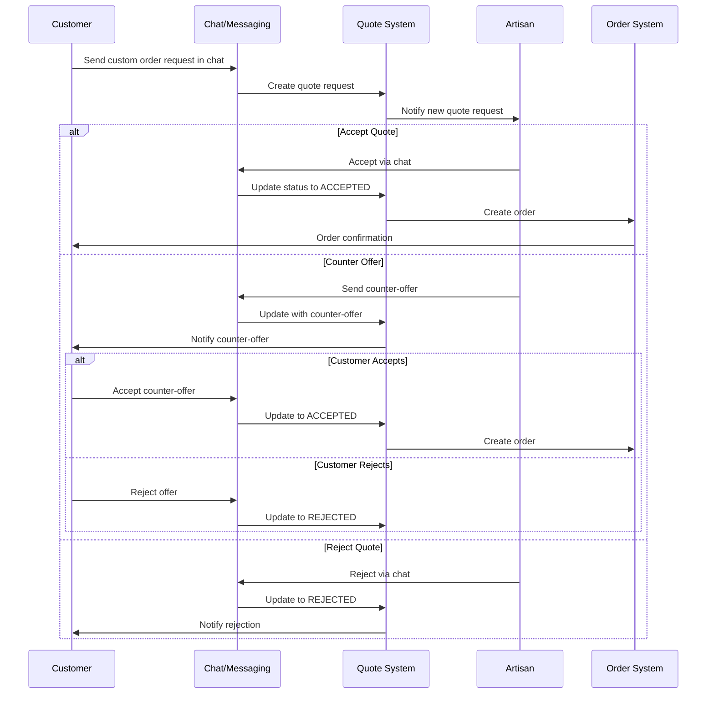
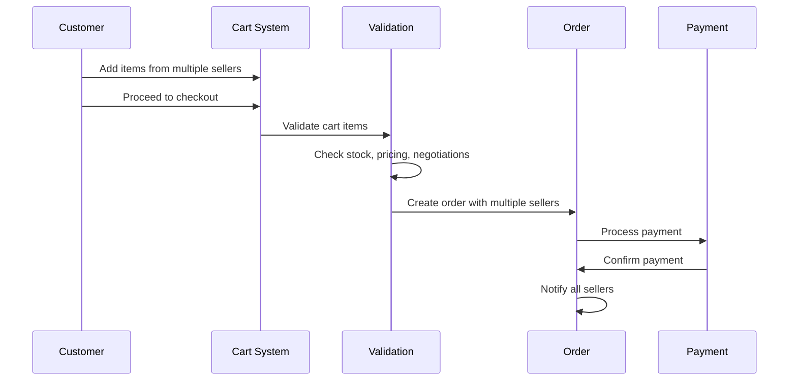

# Artisan Connect - Backend API

This is the backend server for **Artisan Connect**, a social commerce platform designed for artisans and handcrafted products. The platform integrates social networking features with a robust e-commerce system, allowing creators to share their stories, build a community, and sell their work in one place.

## ✨ Key Features

* **Social Commerce Integration**: Artisans can create rich blog-style posts to share their creative process. Users can interact through likes, comments, and by following their favorite creators.
* **E-commerce Engine**: A complete online store for each artisan, featuring product management, a multi-seller shopping cart, and a full order processing workflow.
* **Flexible Pricing System**: The platform supports unique features tailored to the handicraft industry, such as custom order requests and direct price negotiation between buyers and sellers.
* **Real-time Communication**: A live messaging and notification system built with Socket.io enhances interaction for negotiations, customer support, and community updates.
* **Customizable Artisan Profiles**: Artisans can personalize their profile pages to reflect their unique artistic style and build a strong brand identity.
* **Admin Management**: A control panel for administrators to manage users, approve artisan upgrade requests, and oversee platform content.

---

## 🛠️ Tech Stack

The backend is built with a modern, scalable, and efficient technology stack:

* **Backend Framework**: Node.js with Express.js
* **Database**: PostgreSQL for reliable and structured data storage
* **Authentication**: JSON Web Tokens (JWT) for secure, stateless user sessions
* **Real-time Engine**: Socket.io for live messaging and notifications
* **Media Management**: Cloudinary for cloud-based image and video storage, optimization, and delivery
* **Frontend**: The server is designed to work with a React frontend

---

## 🏗️ Architecture

The server's architecture is designed to be modular and maintainable, following a multi-layer pattern that separates the core business logic from the infrastructure and web framework components. This ensures that the system is scalable and easy to extend with new features in the future.

---

## 🔄 Complex Workflows

### 1. Price Negotiation Flow


### 2. Custom Order Workflow


### 3. Multi-Seller Cart & Checkout


## 🗄️ Database Schema Overview

The database schema is centered around several key entities that model the platform's social and commercial activities:

* **Users & Profiles:** User, Profile, and ArtisanProfile tables handle user data, authentication, roles, and shop details.
* **Content & Social:** Post, Comment, Like, and Follow tables manage the social interactions and content creation.
* **E-commerce:** Product, Category, Order, OrderItem, and CartItem tables form the core of the e-commerce functionality.
* **Communication:** Message and Notification tables support the real-time communication features.
* **Pricing:** PriceNegotiation and QuoteRequest tables facilitate the flexible pricing and custom order workflows.

## 🚀 Getting Started

### Prerequisites

* Node.js (v18.x or later)
* npm (v9.x or later)
* PostgreSQL (v14.x or later)
* Git

### Installation & Setup

#### 1. Clone the repository:
```bash
git clone https://github.com/your-organization/artisan-connect-backend.git
   cd artisan-connect-backend
```

#### 2. Install dependencies:
```bash
npm install
```

#### 3. Set up environment variables:

* Copy the example environment file:
```bash
npm install
```

* Edit the `.env` file with your database credentials, JWT secrets, and API keys for external services like Cloudinary.

#### 4. Set up the database:
```bash
# Apply database migrations
   npx prisma migrate dev

   # (Optional) Seed the database with initial data
   npm run seed
```

#### 5. Start the development server:
```bash
npm run dev
```

The API server will be running at `http://localhost:5000`.
