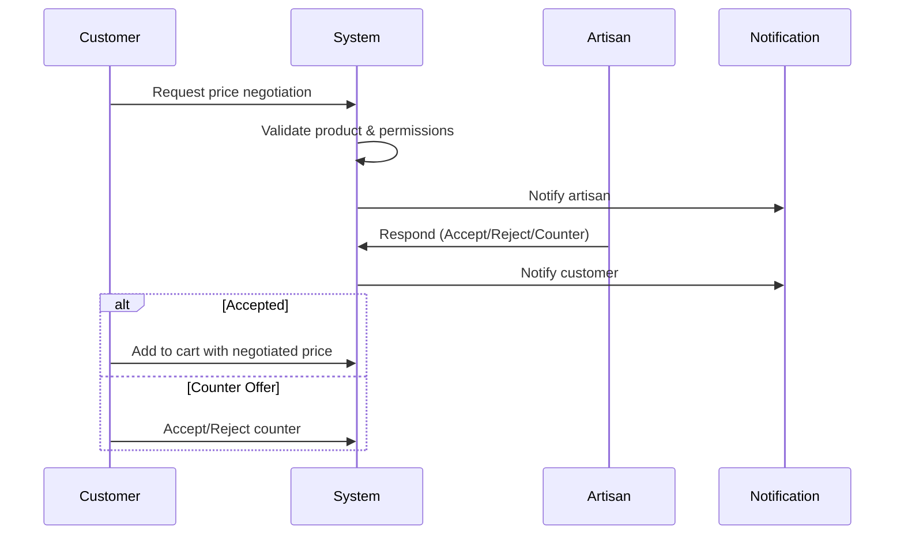
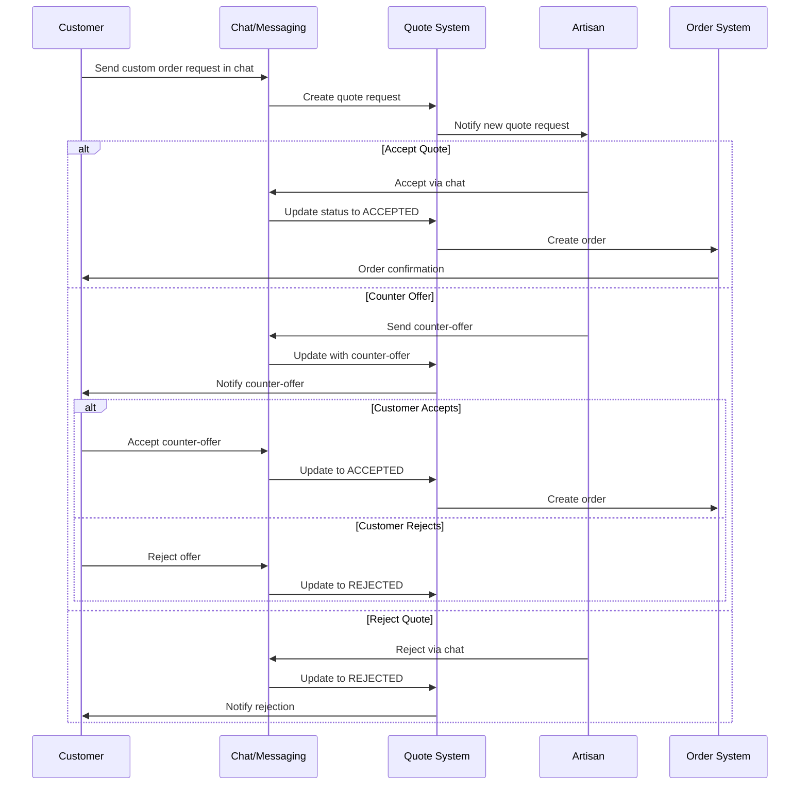
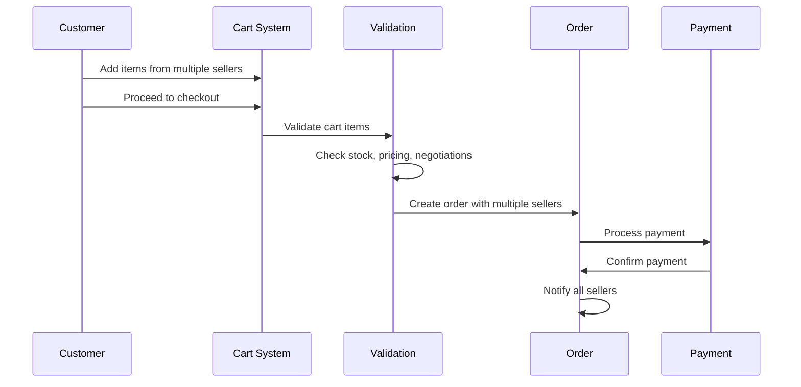

# Artisan Connect - Server

Express API + Socket.io backend for **Artisan Connect**, a social commerce platform for Vietnamese artisans.

> This repository is one half of a two-repo project. The frontend lives in **artisan-connect-client**.
> Both repos are meant to be cloned side-by-side under a shared parent directory that holds the Docker Compose file and shared `.env` - see [Deployment](#deployment) below.

---

## Features

- JWT authentication (access + refresh tokens, httpOnly cookies)
- Role-based access control - ADMIN, ARTISAN, CUSTOMER
- Social layer - posts, comments, likes, follows
- E-commerce engine - products, categories, multi-seller cart, orders
- Price negotiation and custom order (quote request) workflows
- Real-time messaging and notifications via Socket.io
- Cloudinary integration for image/video uploads
- Artisan profile and shop management
- Admin controls - user management, artisan upgrade approvals

---

## Tech stack

| Layer | Technology |
| --- | --- |
| Runtime | Node.js 20 + TypeScript |
| Framework | Express 4 |
| Database | PostgreSQL via Prisma ORM |
| Real-time | Socket.io 4 |
| Auth | JWT (jsonwebtoken) + bcrypt |
| Media | Cloudinary |
| Email | Nodemailer |

---

## Architecture

Each feature lives under `src/modules/[feature]/` and follows a strict 3-layer pattern:

```text
modules/[feature]/
├── interface/
│   ├── routes/       # Express router
│   └── controllers/  # HTTP handling, input validation
├── services/         # Business logic
├── repositories/     # Prisma queries only
└── models/           # DTOs and TypeScript interfaces
```

Data flows strictly downward: Controller → Service → Repository → Prisma → PostgreSQL.

---

## Key workflows

### Price negotiation


```mermaid
sequenceDiagram
    participant C as Customer
    participant S as System
    participant A as Artisan
    participant N as Notification

    C->>S: Request price negotiation
    S->>S: Validate product & permissions
    S->>N: Notify artisan
    A->>S: Respond (Accept/Reject/Counter)
    S->>N: Notify customer
    alt Accepted
        C->>S: Add to cart with negotiated price
    else Counter Offer
        C->>S: Accept/Reject counter
    end
```

### Custom order (quote request)


```mermaid
sequenceDiagram
    participant C as Customer
    participant M as Chat/Messaging
    participant Q as Quote System
    participant A as Artisan
    participant O as Order System

    C->>M: Send custom order request in chat
    M->>Q: Create quote request
    Q->>A: Notify new quote request

    alt Accept Quote
        A->>M: Accept via chat
        M->>Q: Update status to ACCEPTED
        Q->>O: Create order
        O->>C: Order confirmation

    else Counter Offer
        A->>M: Send counter-offer
        M->>Q: Update with counter-offer
        Q->>C: Notify counter-offer

        alt Customer Accepts
            C->>M: Accept counter-offer
            M->>Q: Update to ACCEPTED
            Q->>O: Create order
        else Customer Rejects
            C->>M: Reject offer
            M->>Q: Update to REJECTED
        end

    else Reject Quote
        A->>M: Reject via chat
        M->>Q: Update to REJECTED
        Q->>C: Notify rejection
    end
```

### Multi-seller cart & checkout


```mermaid
sequenceDiagram
    participant C as Customer
    participant Cart as Cart System
    participant V as Validation
    participant O as Order
    participant P as Payment

    C->>Cart: Add items from multiple sellers
    C->>Cart: Proceed to checkout
    Cart->>V: Validate cart items
    V->>V: Check stock, pricing, negotiations
    V->>O: Create order with multiple sellers
    O->>P: Process payment
    P->>O: Confirm payment
    O->>O: Notify all sellers
```

---

## Database

Prisma-managed PostgreSQL. Schema: `prisma/schema.prisma`.

Key model groups:

- **Users & Auth** - User, Profile, ArtisanProfile, Session, RefreshToken
- **Social** - Post, Comment, Like, Follow, Notification
- **E-commerce** - Product, Category, CartItem, Order, OrderItem, Review
- **Pricing** - PriceNegotiation, QuoteRequest
- **Communication** - Message
- **Disputes** - OrderDispute, OrderReturn

Order lifecycle: `PENDING → CONFIRMED → PAID → PROCESSING → SHIPPED → DELIVERED`

Price negotiation lifecycle: `PENDING → COUNTER_OFFERED → ACCEPTED | REJECTED | EXPIRED`

---

## Local development

### Prerequisites

- Node.js 20+
- PostgreSQL running locally (or use Docker - see [Deployment](#deployment))

### Setup

```bash
# Install dependencies
npm install

# Copy and fill in environment variables
cp .env.example .env

# Apply database migrations and generate Prisma client
npm run prisma:migrate
npm run prisma:generate

# (Optional) Seed demo data
npm run seed

# Start dev server with hot reload (port 5000)
npm run dev
```

### Commands

```bash
npm run dev                   # Start with hot reload
npm run build                 # Compile TypeScript to dist/
npm run start                 # Run compiled dist/index.js
npm run typecheck             # TypeScript check
npm run lint                  # ESLint with auto-fix
npm run format                # Prettier

npm run prisma:generate       # Regenerate Prisma client after schema changes
npm run prisma:migrate        # Create and run dev migration
npm run prisma:migrate:deploy # Deploy migrations (production)
npm run prisma:studio         # Open Prisma Studio (DB browser)

npm run seed                  # Seed demo data
npm run seed:fresh            # Reset database and re-seed
```

### Demo accounts (after seeding)

All passwords: `Password123!`

| Role | Email |
| --- | --- |
| Admin | `admin@artisanconnect.vn` |
| Artisan | `gom.su@artisanconnect.vn` |
| Artisan | `tho.thu.cong@artisanconnect.vn` |
| Artisan | `do.go@artisanconnect.vn` |
| Customer | `khachhang1@example.com` |
| Customer | `khachhang2@example.com` |

---

## Deployment

### Monorepo layout

Both repos and the Docker Compose setup are designed to live under a shared parent directory:

```text
artisan-connect/              ← parent directory (not a repo itself)
├── docker-compose.yml         ← orchestrates all three services
├── .env                       ← single env file for the whole stack
├── .env.example               ← template - copy and fill in
├── artisan-connect-client/    ← frontend repo (this repo's sibling)
└── artisan-connect-server/    ← this repo
```

The `docker-compose.yml` in the parent directory builds both the client and server images, spins up a PostgreSQL container, and wires everything together. You do not need a local PostgreSQL install for Docker-based deployment.

### Steps

```bash
# 1. Clone both repos side-by-side
mkdir artisan-connect && cd artisan-connect
git clone https://github.com/cuongnv03/artisan-connect-server.git
git clone https://github.com/cuongnv03/artisan-connect-client.git

# 2. Download docker-compose.yml and .env.example into the parent directory
#    (or copy them from either repo if you have them locally)

# 3. Create your .env from the template
cp .env.example .env
# Edit .env - set JWT secrets, COOKIE_SECRET, Cloudinary keys, etc.

# 4. Start everything
docker compose up --build
```

Services after startup:

| Service | URL |
| --- | --- |
| Client | <http://localhost> |
| Server API | <http://localhost:5000/api> |
| PostgreSQL | `localhost:5432` (internal) |

### Seeding demo data on first boot

Set `SEED_DB=true` in `.env` before the first `docker compose up`. The server will run migrations and then seed the database before starting. Set it back to `false` afterwards - re-seeding is safe (uses upsert) but unnecessary.

### `docker-compose.yml`

Place this file in the parent `artisan-connect/` directory:

```yaml
services:
  postgres:
    image: postgres:16-alpine
    restart: unless-stopped
    environment:
      POSTGRES_USER: ${POSTGRES_USER:-postgres}
      POSTGRES_PASSWORD: ${POSTGRES_PASSWORD:-1234}
      POSTGRES_DB: ${POSTGRES_DB:-artisan_connect}
    volumes:
      - postgres_data:/var/lib/postgresql/data
    healthcheck:
      test: ["CMD-SHELL", "pg_isready -U ${POSTGRES_USER:-postgres}"]
      interval: 10s
      timeout: 5s
      retries: 5

  server:
    build:
      context: ./artisan-connect-server
      dockerfile: Dockerfile
    restart: unless-stopped
    depends_on:
      postgres:
        condition: service_healthy
    environment:
      NODE_ENV: production
      SEED_DB: ${SEED_DB:-false}
      PORT: 5000
      API_PREFIX: /api
      DATABASE_URL: postgresql://${POSTGRES_USER:-postgres}:${POSTGRES_PASSWORD:-1234}@postgres:5432/${POSTGRES_DB:-artisan_connect}?schema=public
      JWT_ACCESS_SECRET: ${JWT_ACCESS_SECRET}
      JWT_REFRESH_SECRET: ${JWT_REFRESH_SECRET}
      JWT_ACCESS_EXPIRATION: ${JWT_ACCESS_EXPIRATION:-24h}
      JWT_REFRESH_EXPIRATION: ${JWT_REFRESH_EXPIRATION:-7d}
      COOKIE_SECRET: ${COOKIE_SECRET}
      CORS_ORIGIN: ${CORS_ORIGIN:-http://localhost}
      CLIENT_URL: ${CLIENT_URL:-http://localhost}
      CLOUDINARY_CLOUD_NAME: ${CLOUDINARY_CLOUD_NAME:-}
      CLOUDINARY_API_KEY: ${CLOUDINARY_API_KEY:-}
      CLOUDINARY_API_SECRET: ${CLOUDINARY_API_SECRET:-}
      EMAIL_HOST: ${EMAIL_HOST:-}
      EMAIL_PORT: ${EMAIL_PORT:-465}
      EMAIL_SECURE: ${EMAIL_SECURE:-true}
      EMAIL_USER: ${EMAIL_USER:-}
      EMAIL_PASSWORD: ${EMAIL_PASSWORD:-}
      EMAIL_FROM_NAME: ${EMAIL_FROM_NAME:-Artisan Connect}
      EMAIL_FROM_ADDRESS: ${EMAIL_FROM_ADDRESS:-}
      RATE_LIMIT_WINDOW_MS: ${RATE_LIMIT_WINDOW_MS:-900000}
      RATE_LIMIT_MAX_REQUESTS: ${RATE_LIMIT_MAX_REQUESTS:-100}
      MAX_FILE_SIZE: ${MAX_FILE_SIZE:-5242880}
    ports:
      - "5000:5000"

  client:
    build:
      context: ./artisan-connect-client
      dockerfile: Dockerfile
    restart: unless-stopped
    depends_on:
      - server
    ports:
      - "80:80"

volumes:
  postgres_data:
```

### `.env.example`

Copy this to `.env` in the same parent directory and fill in the secrets:

```dotenv
# PostgreSQL
POSTGRES_USER=postgres
POSTGRES_PASSWORD=changeme
POSTGRES_DB=artisan_connect

# Set to true to seed the database with demo data on first boot
SEED_DB=false

# JWT - change these in production!
JWT_ACCESS_SECRET=change-me-access-secret
JWT_REFRESH_SECRET=change-me-refresh-secret
JWT_ACCESS_EXPIRATION=24h
JWT_REFRESH_EXPIRATION=7d

# Cookie
COOKIE_SECRET=change-me-cookie-secret

# CORS / Client URL (should be your public domain or http://localhost for local)
CORS_ORIGIN=http://localhost
CLIENT_URL=http://localhost

# Cloudinary (optional - file uploads disabled without these)
CLOUDINARY_CLOUD_NAME=
CLOUDINARY_API_KEY=
CLOUDINARY_API_SECRET=

# Email (optional - email features disabled without these)
EMAIL_HOST=
EMAIL_PORT=465
EMAIL_SECURE=true
EMAIL_USER=
EMAIL_PASSWORD=
EMAIL_FROM_NAME=Artisan Connect
EMAIL_FROM_ADDRESS=
```

Required secrets with no safe default - generate random strings for each:

- `JWT_ACCESS_SECRET` - 32+ characters
- `JWT_REFRESH_SECRET` - 32+ characters, different from the above
- `COOKIE_SECRET` - 32+ characters
- `CLOUDINARY_*` - from your [Cloudinary dashboard](https://cloudinary.com) (app runs without these but image uploads will fail)
